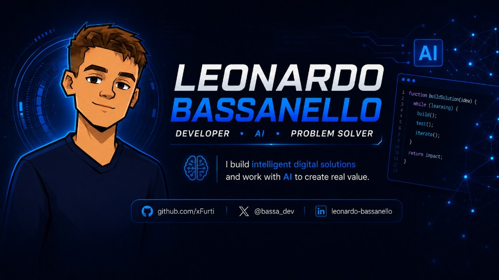
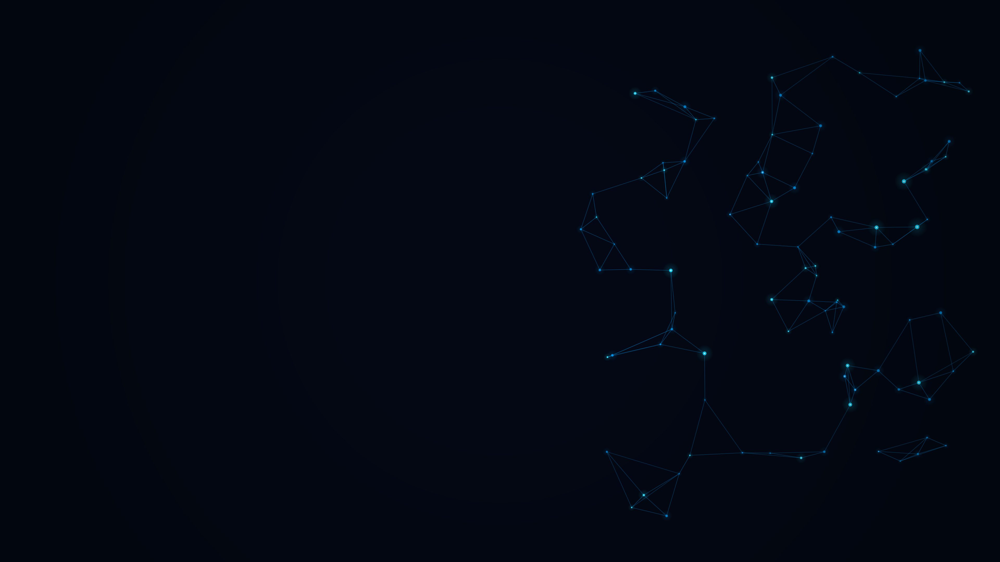
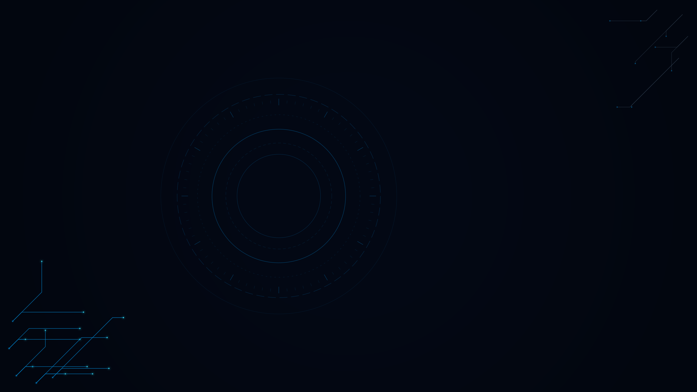
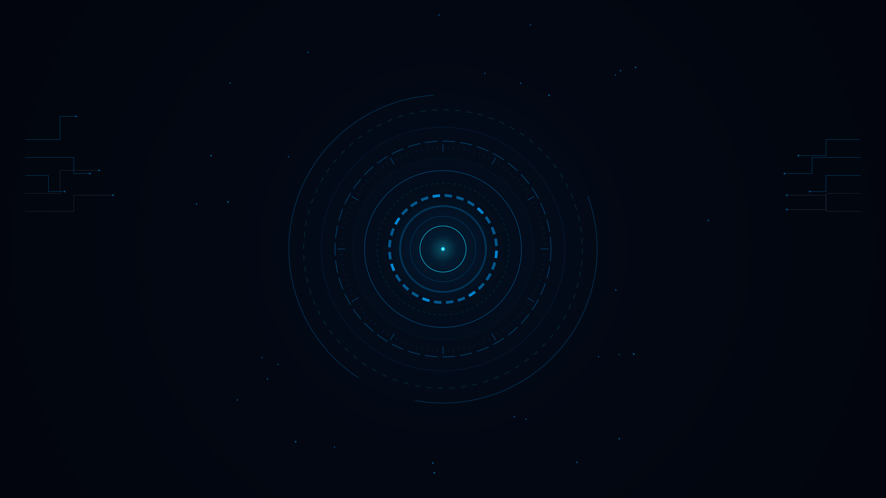
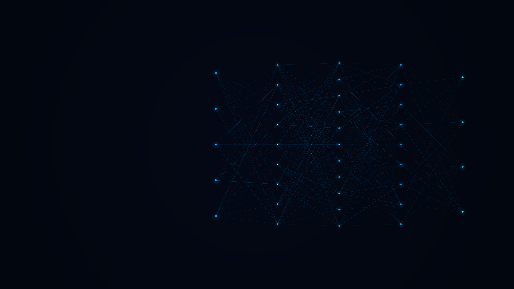
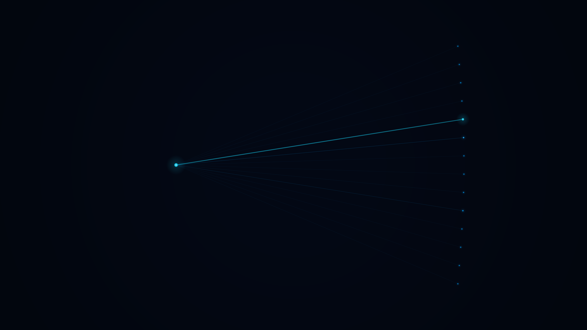
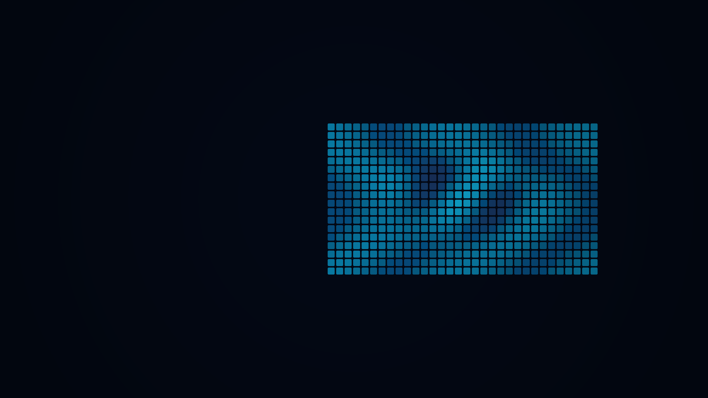
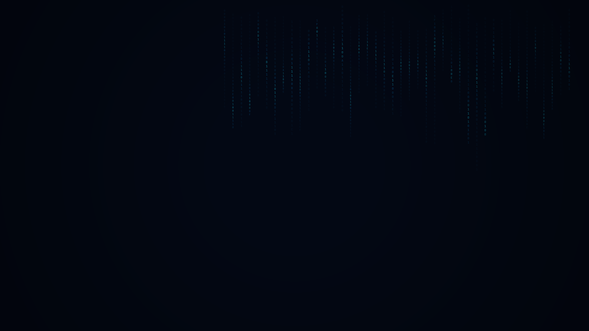
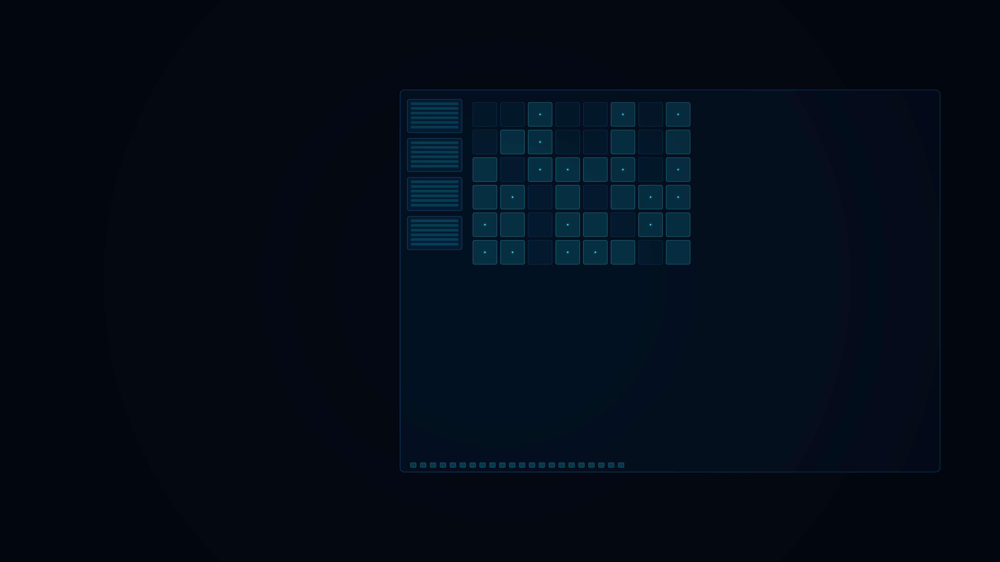

# xFurti

Dark-tech Omarchy theme for [Leonardo Bassanello](https://github.com/xFurti) — **developer · AI · problem solver**.

Navy void, electric-blue glow, and a warm bronze accent taken from the xFurti banner and avatar. Built for daily use on Hyprland, and installable by anyone on Omarchy.



## Palette

Colors were sampled from the brand banner and profile art, then tuned for contrast in terminals, editors, and the Omarchy shell.

| Role | Hex | Swatch |
|------|-----|--------|
| Background | `#040a20` |  |
| Darker background | `#010415` |  |
| Lighter background | `#0e1a32` |  |
| Foreground | `#d6e4f5` |  |
| Muted | `#3d4e63` |  |
| **Accent** | `#00a3ff` |  |
| Cyan (HUD) | `#15d5f9` |  |
| Yellow / bronze | `#ed964f` |  |
| Orange | `#c87438` |  |
| Brown | `#5b3013` |  |
| Green | `#2ec9a0` |  |
| Red | `#f25a7a` |  |
| Magenta | `#8b7eff` |  |

Active Hyprland borders use an electric-blue → HUD-cyan gradient:

```toml
hyprland_active_border = "rgba(00a3ffee) rgba(15d5f9ee) 45deg"
```

`colors.toml` is the single source of truth. Omarchy generates configs for Foot, Alacritty, Ghostty, Kitty, btop, Chromium, Hyprland, Neovim, Helix, VS Code, Obsidian, RGB keyboards, and the entire Omarchy shell (bar, menu, notifications, OSD, lock screen).

## Install

```bash
omarchy-theme-install https://github.com/xFurti/omarchy-xfurti-theme.git
```

Or from the Omarchy menu: **Install → Style → Theme**, then paste the same URL.

After install the theme appears as **xfurti**. Apply it anytime with:

```bash
omarchy theme set xfurti
```

Cycle wallpapers with `Super + Ctrl + Space` (or `omarchy theme bg next`).

Custom unlock art is included. Pick it under **Style → Unlock**.

## Wallpapers

Cycle with `Super + Ctrl + Space`. All ten are 4K, navy + electric blue, and built around tech / AI motifs.

| Neural void | Circuit halo |
| --- | --- |
|  |  |
| **Constellation** | **Aperture** |
|  |  |
| **Architecture** | **Attention** |
|  |  |
| **Weights** | **Latent** |
|  |  |
| **Bitstream** | **Chip** |
|  |  |

## Screenshots

Live desktop captures after install:

| Desktop | Terminal | Neovim |
| --- | --- | --- |
| _Add `docs/desktop.png`_ | _Add `docs/terminal.png`_ | _Add `docs/neovim.png`_ |

| btop | Lock screen |
| --- | --- |
| _Add `docs/btop.png`_ |  |

## Structure

```
omarchy-xfurti-theme/
├── colors.toml           # Required palette (semantic + ANSI)
├── icons.theme           # Yaru-blue
├── keyboard.rgb          # Framework / ROG RGB
├── shell.lock.toml       # Lock screen chrome
├── backgrounds/          # Ten 4K tech/AI wallpapers
├── unlock.png            # Plymouth unlock mark (transparent)
├── preview.png           # Theme switcher card
├── preview-unlock.png    # Unlock preview
├── README.md
└── LICENSE
```

Follows the official Omarchy layout: [Making your own theme](https://omarchy.org/manual/making-your-own-theme/).

## Credits

- Brand, banner, and avatar: [Leonardo Bassanello (xFurti)](https://github.com/xFurti)
- Theming model: [Omarchy](https://omarchy.org/) by [DHH](https://dhh.dk/) / [37signals](https://37signals.com/)
- File manager icons: Yaru-blue

## License

[MIT](LICENSE)
